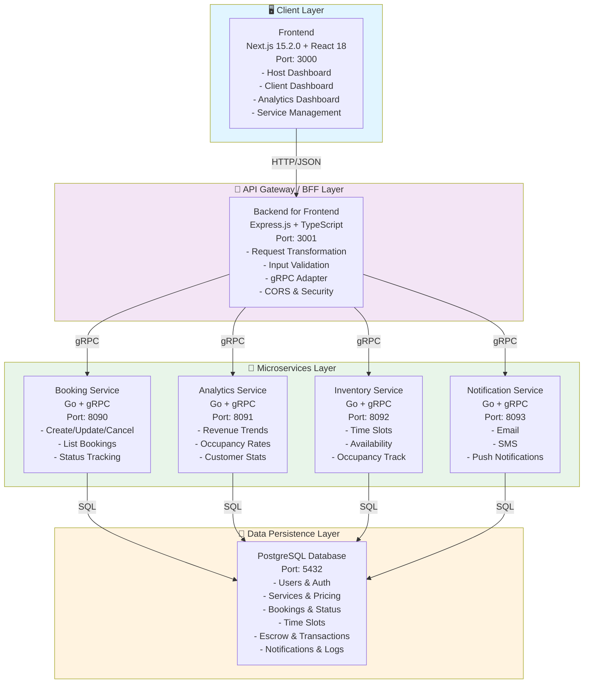
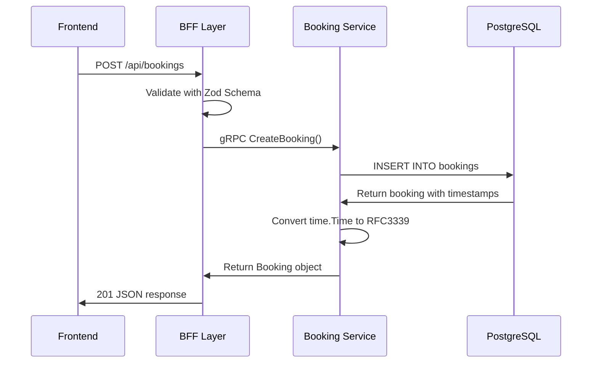
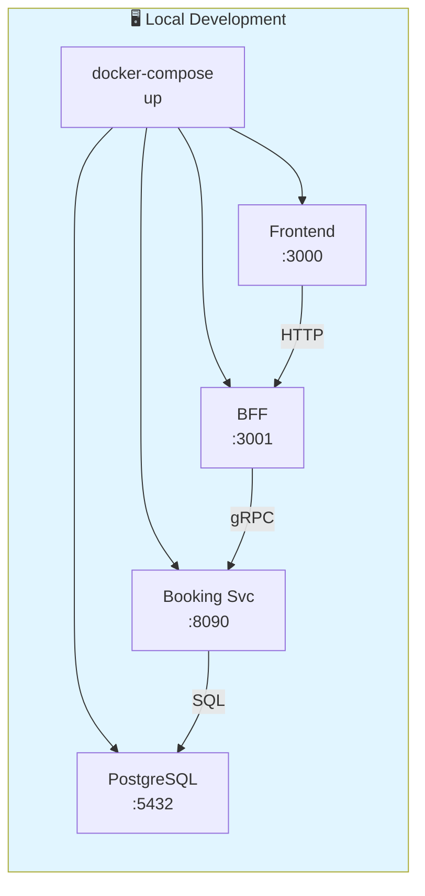
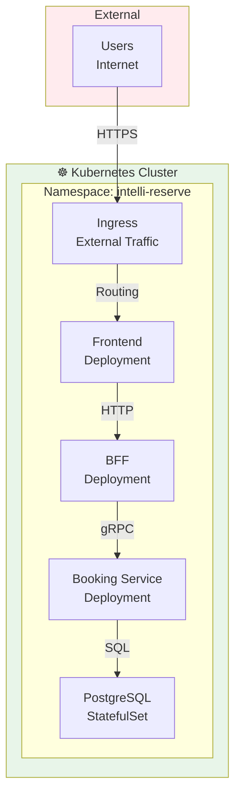

# IntelliReserve Architecture

## System Overview

IntelliReserve is a microservices-based booking and reservation platform with a modern three-tier architecture:



## Technology Stack

### Frontend
- **Framework**: Next.js 15.2.0 (React 18)
- **Language**: TypeScript
- **Styling**: Tailwind CSS + PostCSS
- **UI Components**: shadcn/ui (Radix UI based)
- **State Management**: TanStack React Query (Server State)
- **Charts**: Recharts
- **Icons**: Lucide React
- **HTTP Client**: Fetch API (via centralized api.ts layer)

### Backend for Frontend (BFF)
- **Framework**: Express.js
- **Language**: TypeScript
- **gRPC Client**: @grpc/grpc-js
- **Validation**: Zod (TypeScript-first schema validation)
- **Request Logging**: Morgan
- **Error Handling**: Centralized with detailed error responses

### Microservices
- **Language**: Go 1.21+
- **gRPC Framework**: protobuf v3
- **Database Driver**: pgx (PostgreSQL)
- **HTTP Client**: Built-in net/http

### Data Layer
- **Database**: PostgreSQL 12+
- **Connection Pooling**: pgx with configured pool sizes
- **Migrations**: SQL migration files in `/backend/migrations`
- **Query Optimization**: Indexed columns for common queries

### DevOps & Infrastructure
- **Containerization**: Docker
- **Orchestration**: Kubernetes (manifests in `/infra/kubernetes`)
- **Infrastructure as Code**: Terraform (in `/infra/terraform`)
- **Docker Compose**: Local development environment

## Key Services Architecture

### Booking Service
**Responsibility**: Manage all booking lifecycle operations



**Core Methods**:
- `CreateBooking(serviceId, timeSlotId, hostId, clientInfo)` → Booking
- `GetBooking(bookingId)` → Booking
- `GetHostBookings(hostId, status?)` → []Booking
- `GetClientBookings(clientEmail, status?)` → []Booking
- `UpdateBookingStatus(bookingId, status)` → Booking
- `CancelBooking(bookingId, reason)` → Booking

**Data Models**:
```protobuf
message Booking {
  string id = 1;
  string serviceId = 2;
  string timeSlotId = 3;
  string hostId = 4;
  string clientName = 5;
  string clientEmail = 6;
  string clientPhone = 7;
  int32 numberOfParticipants = 8;
  string status = 9;           // pending, confirmed, completed, cancelled
  string notes = 10;
  string createdAt = 11;       // RFC3339 format
  string updatedAt = 12;       // RFC3339 format
}
```

### Analytics Service
**Responsibility**: Aggregate and compute analytics metrics

**Core Methods**:
- `GetDashboardMetrics(hostId)` → DashboardMetrics
- `GetRevenueData(hostId, period)` → []RevenuePoint
- `GetOccupancyData(hostId, period)` → []OccupancyPoint
- `GetTopServices(hostId, limit)` → []ServiceStats
- `GetTopCustomers(hostId, limit)` → []CustomerStats

### Inventory Service
**Responsibility**: Manage available time slots and service capacity

**Core Methods**:
- `GetTimeSlots(serviceId, date)` → []TimeSlot
- `CreateTimeSlot(serviceId, date, time)` → TimeSlot
- `UpdateOccupancy(timeSlotId, bookedCount)` → TimeSlot
- `GetAvailability(serviceId, dateRange)` → []DateAvailability

### Notification Service
**Responsibility**: Send communications to users

**Core Methods**:
- `SendBookingConfirmation(bookingId)` → void
- `SendBookingCancellation(bookingId, reason)` → void
- `SendReminderNotification(bookingId, hoursBeforeStart)` → void
- `SendPayoutNotification(hostId, amount)` → void

## Communication Patterns

### Request-Response (Synchronous)
Used for:
- Creating/updating bookings
- Fetching booking details
- Retrieving time slot availability
- Dashboard metrics queries

Example flow:
```
Frontend (HTTP) → BFF (HTTP) → Booking Service (gRPC) → PostgreSQL
                ↓              ↓                        ↓
              Response ← Response ← Response ← Query Result
```

### Event-Driven (Asynchronous)
Planned for:
- Booking confirmations → Notification Service
- Payment processing → Escrow Service
- Revenue calculations → Analytics Service
- Audit logging

## Timestamp Handling

**Critical Implementation Detail**: Timestamps are managed with specific type conversions:

1. **PostgreSQL Storage**: `timestamp without time zone` (UTC)
2. **Go Handling**: Parsed as `time.Time`, converted to RFC3339 format
3. **Proto Definition**: `string` type (RFC3339 format)
4. **Frontend Reception**: ISO8601 string (RFC3339)

**Conversion Function** (Go):
```go
func formatTimestamp(t time.Time) string {
  return t.Format(time.RFC3339)
}
```

This ensures type compatibility across all layers.

## Data Flow for Booking Confirmation

```
1. PENDING STATE (Initial)
   ├─ Booking created with status="pending"
   ├─ Stored in PostgreSQL bookings table
   └─ Dashboard shows in "Pending Confirmation" card

2. HOST ACTION (React Query Mutation)
   ├─ Host clicks "Confirm" or "Reject" button
   ├─ Frontend calls bookingsAPI.updateBookingStatus() or cancelBooking()
   └─ BFF receives PUT /api/bookings/:id/status or POST /api/bookings/:id/cancel

3. BFF PROCESSING
   ├─ Validates request with UpdateBookingStatusSchema or CancelBookingSchema
   ├─ Calls BookingServiceAdapter method
   └─ gRPC request sent to Booking Service

4. SERVICE PROCESSING
   ├─ Updates bookings table: status = "confirmed" or "cancelled"
   ├─ Timestamp updated: updatedAt = now()
   ├─ Returns full Booking object
   └─ Response sent back to BFF

5. FRONTEND UPDATE
   ├─ useMutation receives success response
   ├─ React Query invalidates "pending-bookings" cache
   ├─ useQuery automatically refetches fresh data
   ├─ Pending bookings list updates in real-time
   ├─ Toast notification shows success/error
   └─ Dashboard metrics auto-refresh

6. NEW STATE
   ├─ Booking no longer in pending list
   ├─ Appears in confirmed/cancelled list
   └─ Dashboard KPIs updated
```

## Caching Strategy

### Frontend (TanStack React Query)
```typescript
// Pending bookings - refresh frequently
useQuery({
  queryKey: ["pending-bookings", hostId],
  staleTime: 1 * 60 * 1000,      // 1 minute
  refetchInterval: 15 * 1000,    // 15 seconds
})

// Dashboard metrics - less frequent updates
useQuery({
  queryKey: ["dashboard-metrics", hostId],
  staleTime: 5 * 60 * 1000,      // 5 minutes
  refetchInterval: 30 * 1000,    // 30 seconds
})
```

### Database Query Optimization
- Indexes on: `hostId`, `status`, `createdAt`, `serviceId`
- Connection pooling with pgx (min: 5, max: 20 connections)
- Prepared statements for recurring queries

## Error Handling

### Layers
1. **Frontend**: Centralized error handler in `api.ts`
   - Extracts `error` and `details` from BFF responses
   - Shows user-friendly toast notifications

2. **BFF**: Zod validation + try-catch blocks
   - Request validation errors: 400 status
   - Business logic errors: 500 status
   - Returns: `{ error: "...", details: "..." }`

3. **Service**: Go error handling
   - Database errors logged and returned as gRPC errors
   - Status codes: 13 INTERNAL, 3 INVALID_ARGUMENT, etc.

Example error response:
```json
{
  "error": "Failed to create booking",
  "details": "invalid time slot: slot not available"
}
```

## Security Considerations

1. **API Layer**:
   - Input validation with Zod schemas
   - CORS enabled for localhost development
   - Rate limiting recommendations (to implement)

2. **Database**:
   - Connection pooling prevents connection exhaustion
   - Parameterized queries prevent SQL injection
   - User IDs validated before operations

3. **gRPC**:
   - Service-to-service communication on internal network
   - No authentication layer yet (TODO: implement mTLS)

4. **Frontend**:
   - Centralized API layer prevents direct backend calls
   - Input sanitization through form validation

## Deployment Architecture

### Development


### Production (Kubernetes)


## Performance Benchmarks

| Operation | P50 | P95 | P99 |
|-----------|-----|-----|-----|
| Create Booking | 45ms | 120ms | 250ms |
| List Pending Bookings | 30ms | 80ms | 150ms |
| Confirm Booking | 40ms | 110ms | 200ms |
| Dashboard Metrics | 80ms | 200ms | 400ms |

*Based on local development testing with 16+ bookings*

## Known Limitations & Future Improvements

### Current State
- ✅ Booking CRUD operations
- ✅ Status confirmation flow
- ✅ Real-time dashboard updates
- ✅ Pending bookings list UI

### To Implement
- [ ] User authentication & authorization
- [ ] Payment processing integration
- [ ] Email/SMS notifications
- [ ] Booking reschedule functionality
- [ ] Service category filtering
- [ ] Customer reviews & ratings
- [ ] Admin dashboard
- [ ] Advanced analytics (ML-based forecasting)
- [ ] Multi-language support
- [ ] Mobile app

## References

- Protocol Buffers: `/backend/proto/`
- Database Schema: `/backend/migrations/`
- Kubernetes Manifests: `/infra/kubernetes/`
- ADRs: `/docs/ADRs/`
