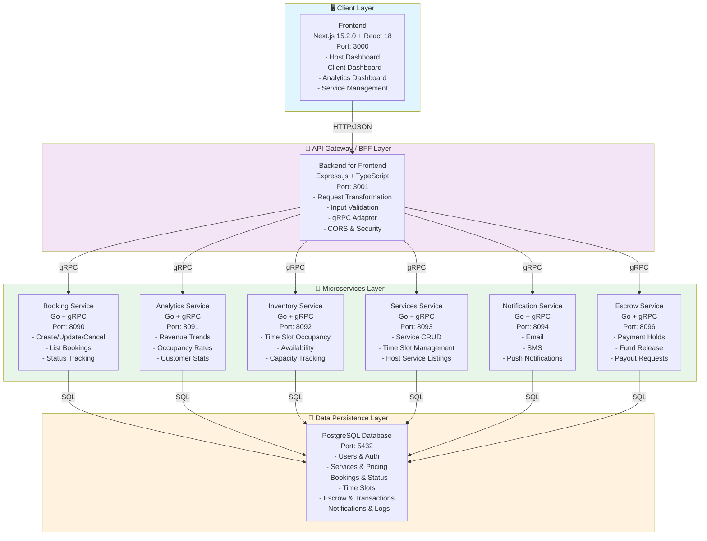
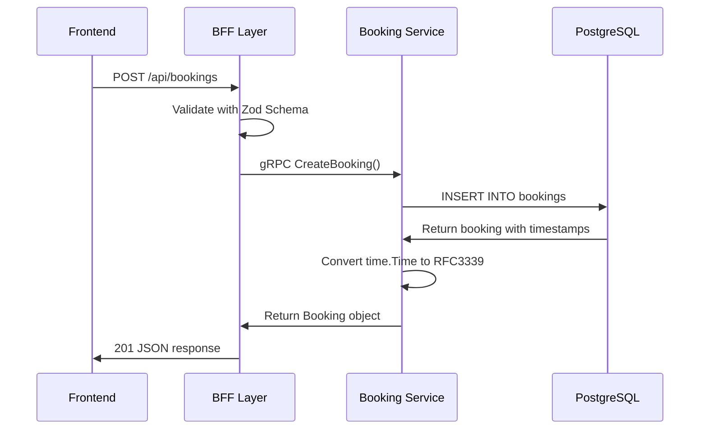
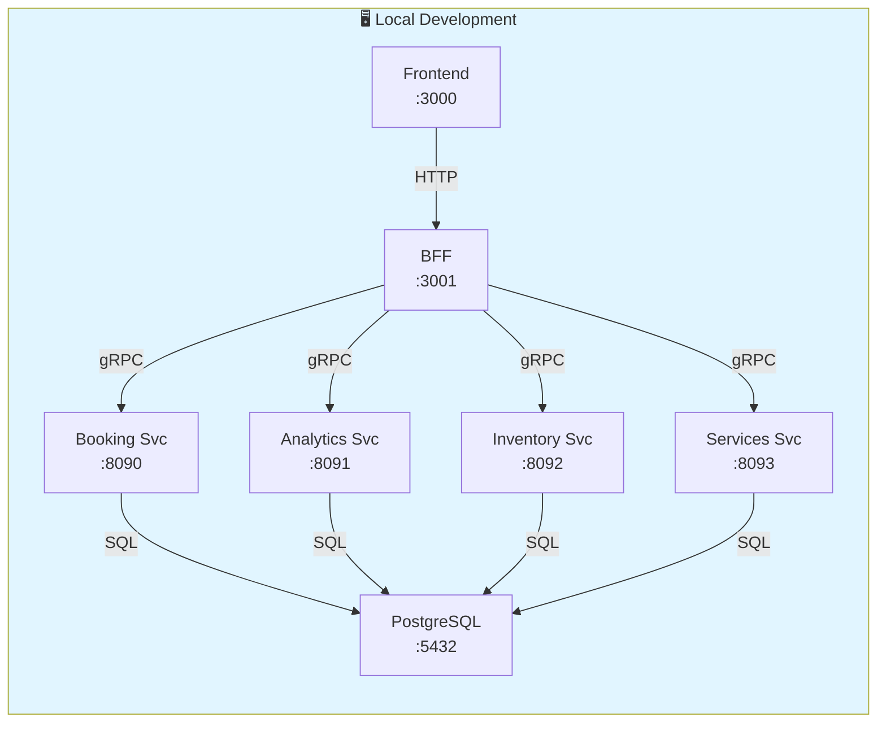
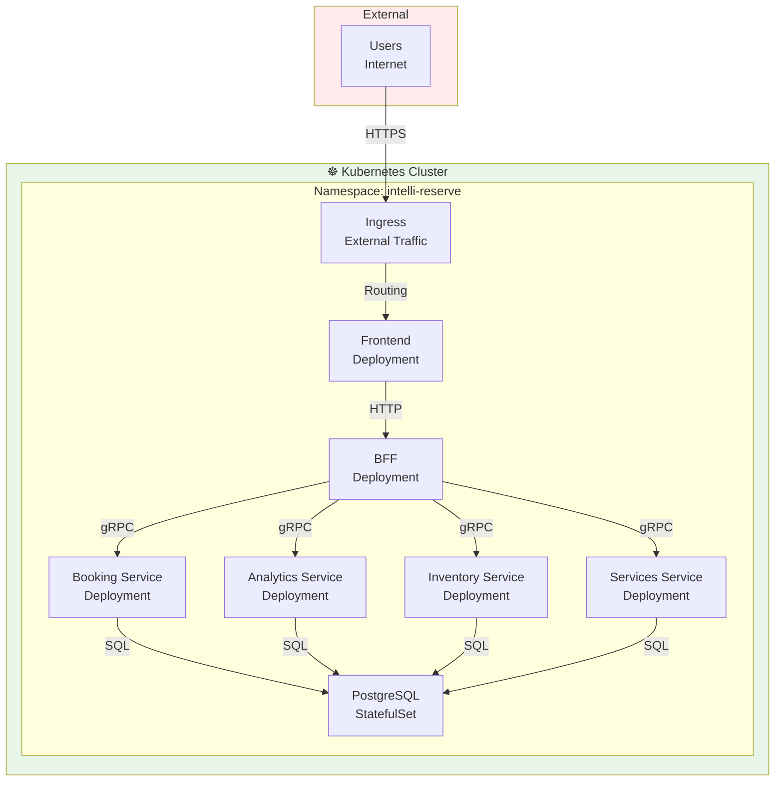

# IntelliReserve Architecture

## System Overview

IntelliReserve is a microservices-based booking and reservation platform with a modern three-tier architecture:



## Technology Stack

### Frontend
- **Framework**: Next.js 15.2.0 (React 18)
- **Language**: TypeScript
- **Styling**: Tailwind CSS + PostCSS
- **UI Components**: shadcn/ui (Radix UI based)
- **State Management**: TanStack React Query (Server State)
- **Charts**: Recharts
- **Icons**: Lucide React
- **HTTP Client**: Fetch API (via centralized api.ts layer)

### Backend for Frontend (BFF)
- **Framework**: Express.js
- **Language**: TypeScript
- **gRPC Client**: @grpc/grpc-js
- **Validation**: Zod (TypeScript-first schema validation)
- **Request Logging**: Morgan
- **Error Handling**: Centralized with detailed error responses

### Microservices
- **Language**: Go 1.21+
- **gRPC Framework**: protobuf v3
- **Database Driver**: pgx (PostgreSQL)
- **HTTP Client**: Built-in net/http

### Data Layer
- **Database**: PostgreSQL 12+
- **Connection Pooling**: pgx with configured pool sizes
- **Migrations**: SQL migration files in `/backend/migrations`
- **Query Optimization**: Indexed columns for common queries

### DevOps & Infrastructure
- **Containerization**: Docker
- **Orchestration**: Kubernetes (manifests in `/infra/kubernetes`)
- **Infrastructure as Code**: Terraform (in `/infra/terraform`)
- **Docker Compose**: Local development environment

## Service Port Registry

| Service | HTTP (Health) | gRPC | Status |
|---------|--------------|------|--------|
| Frontend | 3000 | — | ✅ Live |
| BFF | 3001 | — | ✅ Live |
| Booking Service | 8080 | 8090 | ✅ Live |
| Analytics Service | 8081 | 8091 | ✅ Live |
| Inventory Service | 8082 | 8092 | ✅ Live |
| Services Service | 8083 | 8093 | ✅ Live |
| Notification Service | 8084 | 8094 | ✅ Live |
| Identity Service | 8085 | 8095 | ✅ Live |
| Escrow Service | 8086 | 8096 | ✅ Live |
| Payout Service | 8087 | 8097 | 🔲 Planned |
| Pricing Service | 8088 | 8098 | 🔲 Planned |

## Key Services Architecture

### Booking Service
**Responsibility**: Manage all booking lifecycle operations



**Core Methods**:
- `CreateBooking(serviceId, timeSlotId, hostId, clientInfo)` → Booking
- `GetBooking(bookingId)` → Booking
- `GetHostBookings(hostId, status?)` → []Booking
- `GetClientBookings(clientEmail, status?)` → []Booking
- `UpdateBookingStatus(bookingId, status)` → Booking
- `CancelBooking(bookingId, reason)` → Booking
- `DeleteBooking(bookingId)` → void

**Data Models**:
```protobuf
message Booking {
  string id = 1;
  string serviceId = 2;
  string timeSlotId = 3;
  string hostId = 4;
  string clientName = 5;
  string clientEmail = 6;
  string clientPhone = 7;
  int32 numberOfParticipants = 8;
  string status = 9;           // pending, confirmed, completed, cancelled
  string notes = 10;
  string createdAt = 11;       // RFC3339 format
  string updatedAt = 12;       // RFC3339 format
}
```

### Analytics Service
**Responsibility**: Aggregate and compute analytics metrics live from booking and service data

**Core Methods**:
- `GetDashboardMetrics(hostId)` → DashboardMetrics
- `GetAnalytics(hostId, timeRange)` → AnalyticsData
- `GetRevenueReport(hostId, startDate, endDate)` → RevenueReport
- `GetBookingStatistics(hostId, timeRange)` → BookingStatistics

**Note**: All metrics are computed live via SQL aggregation — no pre-aggregated snapshot tables exist. The `analytics` and `dashboard_metrics` tables were removed in migration 007.

### Inventory Service
**Responsibility**: Track time slot occupancy and capacity in real time

**Core Methods**:
- `GetTimeSlots(serviceId, date)` → []TimeSlotDetail
- `CreateTimeSlot(serviceId, date, startTime, endTime, capacity)` → TimeSlotDetail
- `UpdateOccupancy(timeSlotId, bookedCount)` → TimeSlotDetail
- `GetAvailability(serviceId, dateFrom, dateTo)` → []DateAvailability
- `BlockTimeSlot(timeSlotId, reason)` → TimeSlotDetail
- `GetCapacityStatus(serviceId, date)` → CapacityStatus

**Data Ownership**: The inventory service owns occupancy state (`booked_count`, `is_available` via blocking) on the `time_slots` table. Slot definition (create/delete) is owned by the services service.

### Services Service
**Responsibility**: Own the services and time slot definition domain — the foundational data that all other services depend on

**Core Methods**:
- `CreateService(hostId, name, description, category, durationMinutes, basePrice, maxParticipants)` → Service
- `GetService(serviceId)` → Service
- `GetHostServices(hostId, onlyActive?, limit?, offset?)` → []Service
- `UpdateService(serviceId, fields...)` → Service
- `DeleteService(serviceId)` → void
- `CreateTimeSlot(serviceId, date, startTime, endTime)` → TimeSlot
- `GetTimeSlot(timeSlotId)` → TimeSlot
- `GetAvailableTimeSlots(serviceId, dateFrom, dateTo)` → []TimeSlot
- `UpdateTimeSlotAvailability(timeSlotId, isAvailable)` → TimeSlot
- `DeleteTimeSlot(timeSlotId)` → void

**Data Ownership**: The services service is the authoritative owner of the `services` table and the slot definition layer of `time_slots`. Every booking and analytics query has a foreign key dependency on data this service manages.

### Notification Service
**Responsibility**: Send communications to users across multiple channels

**Core Methods**:
- `SendBookingConfirmation(bookingId, clientEmail, serviceName, slotDate, startTime, hostId)` → SendNotificationResponse
- `SendBookingCancellation(bookingId, clientEmail, serviceName, reason, hostId)` → SendNotificationResponse
- `SendReminderNotification(bookingId, clientEmail, serviceName, hoursBeforeStart, hostId)` → SendNotificationResponse
- `SendPayoutNotification(hostId, hostEmail, amountCents, currency)` → SendNotificationResponse
- `GetNotificationPreferences(userId)` → NotificationPreferences
- `UpdateNotificationPreferences(userId, preferences)` → NotificationPreferences

**Notification Channels**:
- Email (primary)
- SMS (optional)
- Push notifications (optional)

**Data Models**:
```protobuf
message SendNotificationResponse {
  bool success = 1;
  string notification_id = 2;
  string error_message = 3;
}

message NotificationPreferences {
  string user_id = 1;
  bool email_booking_confirmations = 2;
  bool email_booking_reminders = 3;
  bool email_payout_notifications = 4;
  bool sms_booking_confirmations = 5;
  bool sms_booking_reminders = 6;
  bool push_notifications = 7;
  string created_at = 8;
  string updated_at = 9;
}
```

**Database Tables**:
- `notifications` - Stores notification history (id, recipient_email, notification_type, subject, body, channel, status, booking_id, host_id, sent_at, failed_at, created_at, updated_at)
- `notification_preferences` - User notification preferences (user_id, email_*, sms_*, push_*, timestamps)

### Escrow Service
**Responsibility**: Manage payment holds, fund releases, and payout requests for secure transactions

**Core Methods**:
- `GetEscrowAccount(hostId)` → EscrowAccount
- `CreateHold(bookingId, hostId, clientId, grossAmountCents)` → Hold
- `GetHold(holdId)` → Hold
- `ReleaseHold(holdId)` → Hold (Release funds to available balance)
- `RefundHold(holdId, reason)` → Hold (Return funds to client)
- `GetAvailableBalance(hostId)` → Money
- `RequestPayout(hostId, amountCents, bankAccountToken)` → Payout
- `GetPayoutHistory(hostId, limit, offset)` → []Payout
- `GetTransactionHistory(hostId, limit, offset)` → []Transaction
- `ConfirmPayout(payoutId)` → Payout
- `RejectPayout(payoutId, reason)` → Payout
- `HandleDisputeRequest(holdId, reason)` → Dispute

**Data Models**:
```protobuf
message EscrowAccount {
  string id = 1;
  string host_id = 2;
  Money held_balance = 3;           // Locked in active holds
  Money available_balance = 4;      // Ready for payout
  Money total_received = 5;         // Lifetime total received
  Money total_paid_out = 6;         // Lifetime total paid out
  string account_status = 7;        // active, suspended, closed
  string created_at = 8;
  string updated_at = 9;
}

message Hold {
  string id = 1;
  string booking_id = 2;
  string host_id = 3;
  string client_id = 4;
  string status = 5;                // pending, released, refunded
  Money gross_amount = 6;
  Money platform_fee = 7;
  Money host_amount = 8;
  string hold_reason = 9;
  string created_at = 10;
  string updated_at = 11;
}

message Payout {
  string id = 1;
  string host_id = 2;
  Money amount = 3;
  string status = 4;                // pending, processing, completed, failed
  string bank_account_token = 5;
  string created_at = 6;
  string updated_at = 7;
}

message Transaction {
  string id = 1;
  string host_id = 2;
  string transaction_type = 3;      // hold_created, hold_released, payout_requested, etc.
  Money amount = 4;
  Money balance_before = 5;
  Money balance_after = 6;
  string reason = 7;
  string related_hold_id = 8;
  string related_payout_id = 9;
  string created_at = 10;
}

message Money {
  int64 amount_cents = 1;
  string currency = 2;              // e.g., "ZAR"
}
```

**Currency**: All amounts use South African Rand (ZAR) stored as cents in the database

**Database Tables**:
- `escrow_accounts` - Host escrow balances (id, host_id, held_balance_cents, available_balance_cents, total_received_cents, total_paid_out_cents, account_status, timestamps)
- `holds` - Payment holds (id, booking_id, host_id, client_id, status, gross_amount_cents, platform_fee_cents, host_amount_cents, hold_reason, timestamps)
- `payouts` - Payout requests (id, host_id, amount_cents, status, bank_account_token, timestamps)
- `transactions` - Audit log (id, host_id, transaction_type, amount_cents, balance_before_cents, balance_after_cents, reason, hold_id, payout_id, created_at)

**Indexes**:
- `(host_id, account_status)` - Fast account lookups
- `(booking_id)` - Find holds by booking
- `(host_id, status)` on both holds and payouts - Status filtering by host
- `(created_at DESC)` on transactions - Timeline queries
- 27 total indexes covering all query patterns

**Connection Management**: Uses pgxpool.Pool (25 max connections, 5 min connections) to handle concurrent requests without "conn busy" errors


| BFF Route | Method(s) | Backend |
|-----------|-----------|---------|
| `/api/bookings` | POST, GET | Booking Service gRPC :8090 |
| `/api/bookings/:id` | GET | Booking Service gRPC :8090 |
| `/api/bookings/:id/status` | PUT | Booking Service gRPC :8090 |
| `/api/bookings/:id/cancel` | POST | Booking Service gRPC :8090 |
| `/api/dashboard/metrics` | GET | Analytics Service gRPC :8091 |
| `/api/analytics` | GET | Analytics Service gRPC :8091 |
| `/api/services` | GET, POST | Services Service gRPC :8093 |
| `/api/services/:id` | PUT, PATCH, DELETE | Services Service gRPC :8093 |
| `/api/services/bulk/delete` | POST | Services Service gRPC :8093 |
| `/api/services/time-slots` | GET, POST | Services Service gRPC :8093 |
| `/api/services/time-slots/:id` | DELETE | Services Service gRPC :8093 |
| `/api/services/time-slots/:id/availability` | PATCH | Services Service gRPC :8093 |
| `/api/services/time-slots/:id/block` | PATCH | Inventory Service gRPC :8092 |
| `/api/services/availability` | GET | Inventory Service gRPC :8092 |
| `/api/services/capacity` | GET | Inventory Service gRPC :8092 |
| `/api/services/recurring-slots` | POST | Services Service gRPC :8093 |
| `/api/notifications/booking/confirmation` | POST | Notification Service gRPC :8094 |
| `/api/notifications/booking/cancellation` | POST | Notification Service gRPC :8094 |
| `/api/notifications/reminder` | POST | Notification Service gRPC :8094 |
| `/api/notifications/payout` | POST | Notification Service gRPC :8094 |
| `/api/notifications/preferences` | GET, PUT | Notification Service gRPC :8094 |
| `/api/escrow/account` | GET | Escrow Service gRPC :8096 |
| `/api/escrow/holds` | GET, POST | Escrow Service gRPC :8096 |
| `/api/escrow/holds/:id` | GET | Escrow Service gRPC :8096 |
| `/api/escrow/holds/:id/release` | POST | Escrow Service gRPC :8096 |
| `/api/escrow/holds/:id/refund` | POST | Escrow Service gRPC :8096 |
| `/api/escrow/balance` | GET | Escrow Service gRPC :8096 |
| `/api/escrow/payouts` | GET, POST | Escrow Service gRPC :8096 |
| `/api/escrow/payouts/:id` | GET | Escrow Service gRPC :8096 |
| `/api/escrow/payouts/:id/confirm` | POST | Escrow Service gRPC :8096 |
| `/api/escrow/payouts/:id/reject` | POST | Escrow Service gRPC :8096 |
| `/api/escrow/transactions` | GET | Escrow Service gRPC :8096 |
| `/api/escrow/disputes` | GET, POST | Escrow Service gRPC :8096 |
| `/api/auth/*` | * | Direct DB (identity service planned) |
| `/api/users/*` | * | Direct DB (identity service planned) |

## Communication Patterns

### Request-Response (Synchronous)
Used for:
- Creating/updating bookings
- Fetching booking details
- Retrieving time slot availability
- Dashboard metrics queries
- Service CRUD operations

Example flow:
```
Frontend (HTTP) → BFF (HTTP) → Booking Service (gRPC) → PostgreSQL
                ↓              ↓                        ↓
              Response ← Response ← Response ← Query Result
```

### Event-Driven (Asynchronous)
Planned for:
- Booking confirmations → Notification Service
- Payment processing → Escrow Service
- Revenue calculations → Analytics Service
- Audit logging

## Data Ownership by Service

```
users                          ← Identity Service (planned, currently direct DB)
  └── services                 ← Services Service (:8093)
        └── time_slots         ← Services Service (definition) + Inventory Service (occupancy)
              └── bookings     ← Booking Service (:8090)
                    └── analytics queries  ← Analytics Service (:8091, read-only joins)
```

## Timestamp Handling

**Critical Implementation Detail**: Timestamps are managed with specific type conversions:

1. **PostgreSQL Storage**: `timestamp without time zone` (UTC)
2. **Go Handling**: Parsed as `time.Time`, converted to RFC3339 format
3. **Proto Definition**: `string` type (RFC3339 format)
4. **Frontend Reception**: ISO8601 string (RFC3339)

**Conversion Function** (Go):
```go
func formatTimestamp(t time.Time) string {
  return t.Format(time.RFC3339)
}
```

This ensures type compatibility across all layers.

## Data Flow for Booking Confirmation

```
1. PENDING STATE (Initial)
   ├─ Booking created with status="pending"
   ├─ Stored in PostgreSQL bookings table
   └─ Dashboard shows in "Pending Confirmation" card

2. HOST ACTION (React Query Mutation)
   ├─ Host clicks "Confirm" or "Reject" button
   ├─ Frontend calls bookingsAPI.updateBookingStatus() or cancelBooking()
   └─ BFF receives PUT /api/bookings/:id/status or POST /api/bookings/:id/cancel

3. BFF PROCESSING
   ├─ Validates request with UpdateBookingStatusSchema or CancelBookingSchema
   ├─ Calls BookingServiceAdapter method
   └─ gRPC request sent to Booking Service

4. SERVICE PROCESSING
   ├─ Updates bookings table: status = "confirmed" or "cancelled"
   ├─ Timestamp updated: updatedAt = now()
   ├─ Returns full Booking object
   └─ Response sent back to BFF

5. FRONTEND UPDATE
   ├─ useMutation receives success response
   ├─ React Query invalidates "pending-bookings" cache
   ├─ useQuery automatically refetches fresh data
   ├─ Pending bookings list updates in real-time
   ├─ Toast notification shows success/error
   └─ Dashboard metrics auto-refresh

6. NEW STATE
   ├─ Booking no longer in pending list
   ├─ Appears in confirmed/cancelled list
   └─ Dashboard KPIs updated
```

## Data Flow for Escrow Payment Hold Lifecycle

```
1. BOOKING CONFIRMED
   ├─ Host confirms a booking
   ├─ Booking status = "confirmed"
   └─ Escrow Service automatically creates a hold

2. HOLD CREATED
   ├─ Payment amount calculated: gross = base price + platform fee
   ├─ Hold record created with status="pending"
   ├─ Held balance increases: available_balance - hold_amount
   ├─ Transaction logged: "hold_created"
   └─ Client sees hold notification (optional)

3. BOOKING EXECUTION
   ├─ Service date arrives
   ├─ Host completes the booking
   └─ Host marks booking complete (future feature)

4. HOLD RELEASE (Manual or Auto-triggered)
   ├─ Host requests fund release via Escrow Dashboard
   ├─ BFF validates: booking completed, hold status = pending
   ├─ ReleaseHold() called on Escrow Service
   ├─ Hold status updated to "released"
   ├─ Funds moved: held_balance → available_balance
   ├─ Platform fee deducted from host amount
   ├─ Transaction logged: "hold_released"
   └─ Notification sent to host

5. PAYOUT REQUEST
   ├─ Host clicks "Request Payout" on Escrow Dashboard
   ├─ Host specifies amount (≤ available_balance)
   ├─ Payout request created with status="pending"
   ├─ Available balance reduced by payout amount
   ├─ Transaction logged: "payout_requested"
   └─ Host sees payout in history with "pending" status

6. PAYOUT PROCESSING (Future: Payout Service)
   ├─ Payout Service picks up request
   ├─ Initiates bank transfer
   ├─ Updates status to "processing" → "completed"
   ├─ Transaction logged: "payout_completed"
   ├─ Email confirmation sent to host
   └─ Funds reflected in host's bank account (2-3 business days)

7. REFUND SCENARIO (If booking cancelled before release)
   ├─ Booking cancelled by host before completion
   ├─ RefundHold() called on Escrow Service
   ├─ Hold status updated to "refunded"
   ├─ Funds moved: held_balance → available_balance (NOT host's)
   ├─ Client initiates refund withdrawal (future)
   └─ Transaction logged: "hold_refunded"
```

## Caching Strategy

### Frontend (TanStack React Query)
```typescript
// Pending bookings - refresh frequently
useQuery({
  queryKey: ["pending-bookings", hostId],
  staleTime: 1 * 60 * 1000,      // 1 minute
  refetchInterval: 15 * 1000,    // 15 seconds
})

// Dashboard metrics - less frequent updates
useQuery({
  queryKey: ["dashboard-metrics", hostId],
  staleTime: 5 * 60 * 1000,      // 5 minutes
  refetchInterval: 30 * 1000,    // 30 seconds
})
```

### Database Query Optimization
- Indexes on: `hostId`, `status`, `createdAt`, `serviceId`, `clientEmail`
- Composite indexes: `(host_id, status)`, `(host_id, created_at DESC)`, `(service_id, slot_date)`
- Connection pooling with pgx
- Prepared statements for recurring queries

## Error Handling

### Layers
1. **Frontend**: Centralized error handler in `api.ts`
   - Extracts `error` and `details` from BFF responses
   - Shows user-friendly toast notifications

2. **BFF**: Zod validation + try-catch blocks
   - Request validation errors: 400 status
   - Business logic errors: 500 status
   - Returns: `{ error: "...", details: "..." }`

3. **Service**: Go error handling
   - Database errors logged and returned as gRPC errors
   - Status codes: 13 INTERNAL, 3 INVALID_ARGUMENT, 5 NOT_FOUND, etc.

Example error response:
```json
{
  "error": "Failed to create booking",
  "details": "invalid time slot: slot not available"
}
```

## Security Considerations

1. **API Layer**:
   - Input validation with Zod schemas
   - CORS enabled for localhost development
   - Rate limiting recommendations (to implement)

2. **Database**:
   - Connection pooling prevents connection exhaustion
   - Parameterized queries prevent SQL injection
   - User IDs validated before operations

3. **gRPC**:
   - Service-to-service communication on internal network
   - No authentication layer yet (TODO: implement mTLS)

4. **Frontend**:
   - Centralized API layer prevents direct backend calls
   - Input sanitization through form validation

## Deployment Architecture

### Development


### Production (Kubernetes)


## Performance Benchmarks

| Operation | P50 | P95 | P99 |
|-----------|-----|-----|-----|
| Create Booking | 45ms | 120ms | 250ms |
| List Pending Bookings | 30ms | 80ms | 150ms |
| Confirm Booking | 40ms | 110ms | 200ms |
| Dashboard Metrics | 80ms | 200ms | 400ms |

*Based on local development testing with 16+ bookings*

## Current State & Roadmap

### Live Services
- ✅ **Booking Service** — full CRUD, status lifecycle
- ✅ **Analytics Service** — live metrics, revenue, occupancy, booking stats
- ✅ **Inventory Service** — time slot occupancy, availability, capacity tracking
- ✅ **Services Service** — service CRUD, time slot definition management
- ✅ **Notification Service** — email confirmations, cancellations, reminders, payouts, user preferences
- ✅ **Identity Service** — user registration, login, JWT tokens, session management, password management
- ✅ **Escrow Service** — payment holds, fund release, payout requests, transaction audit log
- ✅ **Host Dashboard** — pending bookings, metrics, revenue charts, escrow balance display
- ✅ **Host Escrow Dashboard** — balance overview, payout history, transaction history, fund requests
- ✅ **Analytics Dashboard** — revenue trends, top services, customer stats
- ✅ **My Services page** — create, edit, delete, bulk actions
- ✅ **Booking creation flow** — client-facing booking page

### To Implement
- [ ] Payout Service (Port 8097) — bank transfer processing and settlement
- [ ] Pricing Service (Port 8098) — dynamic pricing rules
- [ ] Booking reschedule functionality
- [ ] Customer reviews & ratings
- [ ] Admin dashboard
- [ ] Notification channels (SendGrid email, Twilio SMS, Firebase push)
- [ ] JWT token implementation (currently scaffolded)
- [ ] mTLS between services
- [ ] Event-driven architecture (Kafka/RabbitMQ) for async flows
- [ ] Advanced analytics (ML-based forecasting)

## References

- Protocol Buffers: `/backend/proto/`
- Database Schema: `/backend/migrations/`
- Kubernetes Manifests: `/infra/kubernetes/`
- ADRs: `/docs/ADRs/`
