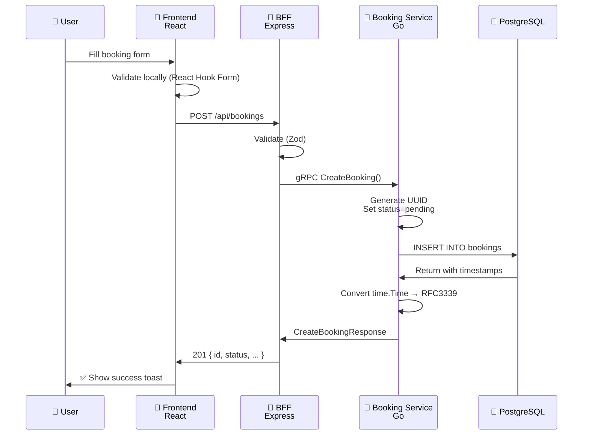
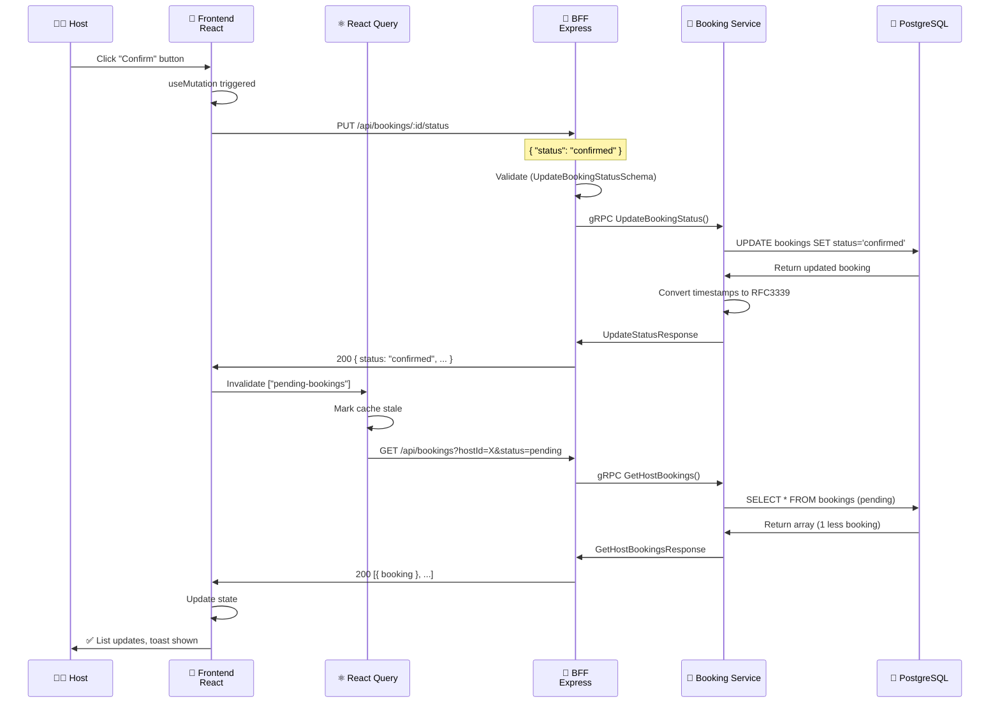
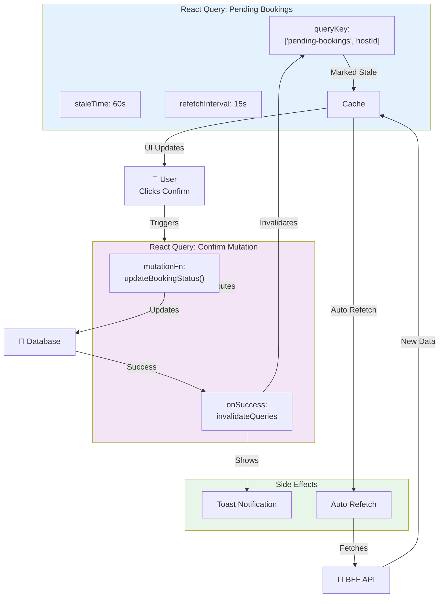
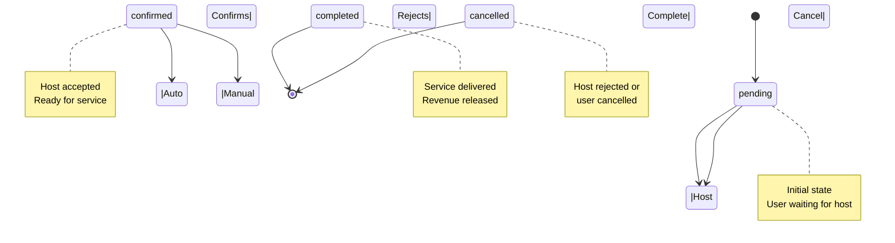

# Data Flow Documentation

## Overview

This document details the complete data flow through the IntelliReserve system for each major operation. Data flows through multiple layers with transformations at each stage.

## 1. Booking Creation Flow



### Step 1: User Input (Frontend)
```
User fills form on /dashboard/book:
├─ Service ID: <UUID>
├─ Time Slot ID: <UUID>
├─ Host ID: <HOST_ID>
├─ Client Name: <Client Name>
├─ Client Email: <client@email.com>
├─ Number of Participants: 1
└─ Notes: "Group booking"
```

### Step 2: Frontend Validation
```typescript
// frontend/src/app/dashboard/book/page.tsx
const formData = {
  serviceId: formState.serviceId,
  timeSlotId: formState.timeSlotId,
  hostId: formState.hostId,
  clientName: formState.clientName,
  clientEmail: formState.clientEmail,
  numberOfParticipants: formState.numberOfParticipants,
  notes: formState.notes,
};

// React Hook Form + Zod validates locally first
// Form won't submit if validation fails
```

### Step 3: API Request to BFF
```
POST http://localhost:3001/api/bookings
Content-Type: application/json

{
  "serviceId": "<UUID>",
  "timeSlotId": "<UUID>",
  "hostId": "<HOST_ID>",
  "clientName": "<Client Name>",
  "clientEmail": "<client@email.com>",
  "numberOfParticipants": 1,
  "notes": "<Optional notes>"
}
```

### Step 4: BFF Processing
```typescript
// bff/src/routes/booking.routes.ts → POST /
1. Parse request body
2. Validate with CreateBookingSchema (Zod)
   ├─ Checks: all required fields present and correct types
   └─ Throws ZodError if invalid

3. Call BookingServiceAdapter.createBooking()
   ├─ Transforms data to gRPC format
   └─ Sends gRPC request to Booking Service on :8090
```

### Step 5: gRPC Call to Booking Service
```protobuf
// Generated from backend/proto/booking.proto
service BookingService {
  rpc CreateBooking(CreateBookingRequest) returns (CreateBookingResponse);
}

CreateBookingRequest {
  string serviceId = 1;
  string timeSlotId = 2;
  string hostId = 3;
  string clientName = 4;
  string clientEmail = 5;
  string clientPhone = 6;
  int32 numberOfParticipants = 7;
  string notes = 8;
}
```

### Step 6: Service Processing (Go)
```go
// backend/booking-service/grpc_handlers.go → CreateBooking()

1. Extract request fields
2. Generate new booking ID (UUID)
3. Set initial status: "pending"
4. Insert into PostgreSQL bookings table
   
   INSERT INTO bookings (
     id, service_id, time_slot_id, host_id,
     client_name, client_email, client_phone,
     number_of_participants, status, notes,
     created_at, updated_at
   ) VALUES (...)
   RETURNING id, ..., created_at, updated_at

5. Scan result into time.Time variables
6. Convert timestamps to RFC3339 format
7. Build response with full Booking object
```

### Step 7: Database Storage
```sql
-- PostgreSQL bookings table
INSERT INTO bookings (
  id, service_id, time_slot_id, host_id,
  client_name, client_email, client_phone,
  number_of_participants, status, notes,
  created_at, updated_at
) VALUES (
  '<BOOKING_UUID>',
  '<SERVICE_UUID>',
  '<TIME_SLOT_UUID>',
  '<HOST_ID>',
  '<Client Name>',
  '<client@email.com>',
  NULL,
  1,
  'pending',
  '<Optional notes>',
  '2026-04-13T01:50:51Z',
  '2026-04-13T01:50:51Z'
);
```

### Step 8: Response Back Through Stack
```go
// Service returns CreateBookingResponse
CreateBookingResponse {
  Booking booking = 1;
  string message = 2;
}

Booking {
  id: "<BOOKING_UUID>"
  serviceId: "<SERVICE_UUID>"
  timeSlotId: "<TIME_SLOT_UUID>"
  hostId: "<HOST_ID>"
  clientName: "<Client Name>"
  clientEmail: "<client@email.com>"
  status: "pending"
  notes: "<Optional notes>"
  createdAt: "2026-04-13T01:50:51Z"
  updatedAt: "2026-04-13T01:50:51Z"
}
```

### Step 9: BFF Response Transformation
```typescript
// bff/src/routes/booking.routes.ts
res.status(201).json({
  id: response.booking?.id,
  serviceId: response.booking?.serviceId,
  timeSlotId: response.booking?.timeSlotId,
  hostId: response.booking?.hostId,
  clientName: response.booking?.clientName,
  clientEmail: response.booking?.clientEmail,
  clientPhone: response.booking?.clientPhone,
  numberOfParticipants: response.booking?.numberOfParticipants,
  status: response.booking?.status || 'pending',
  notes: response.booking?.notes,
  createdAt: response.booking?.createdAt,
  updatedAt: response.booking?.updatedAt,
})
```

### Step 10: Frontend Reception & UI Update
```typescript
// frontend/src/app/dashboard/book/page.tsx
const mutation = useMutation({
  mutationFn: (data) => bookingsAPI.createBooking(data),
  onSuccess: (response) => {
    // response = full Booking object
    toast({
      title: "✅ Booking created!",
      description: `Booking ID: ${response.id}`,
    });
    
    // Redirect to confirmation or close modal
    router.push(`/dashboard/booking/${response.id}`);
  },
});
```

### Complete Timeline
```
User Input (Frontend)
    ↓ ~5ms (validation)
API Request (HTTP to BFF on :3001)
    ↓ ~10ms (transit)
BFF Processing (Zod validation, gRPC adapter)
    ↓ ~5ms (transit)
gRPC Call to Booking Service (:8090)
    ↓ ~15ms (service processing)
PostgreSQL Query (INSERT)
    ↓ ~20ms (DB latency)
Response Through Stack
    ↓ ~30ms (serialization + transit back)
Frontend UI Update
    
Total: ~85ms P50, ~200ms P95
```

---

## 2. Booking Confirmation Flow



### Step 1: Host Dashboard Display
```typescript
// frontend/src/app/dashboard/host/page.tsx
const { data: pendingBookings = [] } = useQuery({
  queryKey: ["pending-bookings", hostId],
  queryFn: () => bookingsAPI.getHostBookings(hostId, 'pending'),
  staleTime: 1 * 60 * 1000,
  refetchInterval: 15 * 1000,
});

// Displays:
// ┌─────────────────────────────┐
// │ Pending Confirmation        │
// │ 15 pending                  │
// ├─────────────────────────────┤
// │ ☐ <Client Name> | 2026-04-13│
// │   [Confirm] [Reject]        │
// │                             │
// │ ☐ <Client Name> | 2026-04-14│
// │   [Confirm] [Reject]        │
// └─────────────────────────────┘
```

### Step 2: Host Clicks Confirm Button
```typescript
// User interaction
<Button
  onClick={() => confirmBookingMutation.mutate(booking.id)}
>
  <Check className="h-3.5 w-3.5" />
  Confirm
</Button>

// Mutation triggers
const confirmBookingMutation = useMutation({
  mutationFn: (bookingId: string) => 
    bookingsAPI.updateBookingStatus(bookingId, 'confirmed'),
  onSuccess: () => {
    // Invalidate cache to trigger refetch
    queryClient.invalidateQueries({ 
      queryKey: ["pending-bookings", hostId] 
    });
    queryClient.invalidateQueries({ 
      queryKey: ["dashboard-metrics", hostId] 
    });
    toast({ title: "Booking Confirmed ✅" });
  },
});
```

### Step 3: API Request to BFF
```
PUT http://localhost:3001/api/bookings/<BOOKING_ID>/status
Content-Type: application/json

{
  "status": "confirmed"
}
```

### Step 4: BFF Validation & Processing
```typescript
// bff/src/routes/booking.routes.ts → PUT /:bookingId/status
1. Extract bookingId from URL params: "<BOOKING_ID>"
2. Validate request body with UpdateBookingStatusSchema
   ├─ Checks: status is one of ['pending', 'confirmed', 'completed', 'cancelled']
   └─ Throws error if not a valid enum value

3. Call BookingServiceAdapter.updateBookingStatus(bookingId, 'confirmed')
   └─ Sends gRPC request to Booking Service
```

### Step 5: gRPC Update Request
```protobuf
service BookingService {
  rpc UpdateBookingStatus(UpdateStatusRequest) 
    returns (UpdateStatusResponse);
}

UpdateStatusRequest {
  string booking_id = 1;      // "<BOOKING_ID>"
  string new_status = 2;      // "confirmed"
}
```

### Step 6: Database Update (Go)
```go
// backend/booking-service/grpc_handlers.go → UpdateBookingStatus()

1. Receive bookingId="<BOOKING_ID>", status="confirmed"
2. Execute SQL UPDATE
   
   UPDATE bookings
   SET status = 'confirmed',
       updated_at = NOW()
   WHERE id = '<BOOKING_ID>'
   RETURNING id, ..., created_at, updated_at

3. Scan result timestamps into time.Time
4. Convert to RFC3339 format
5. Return updated Booking object
```

### Step 7: Database State Change
```sql
-- BEFORE
SELECT * FROM bookings WHERE id = '<BOOKING_ID>';
┌──────┬──────────┬─────────┬──────────┐
│ id   │ status   │ created │ updated  │
├──────┼──────────┼─────────┼──────────┤
│ ...  │ pending  │ 01:50   │ 01:50    │
└──────┴──────────┴─────────┴──────────┘

-- AFTER
SELECT * FROM bookings WHERE id = '<BOOKING_ID>';
┌──────┬──────────┬─────────┬──────────┐
│ id   │ status   │ created │ updated  │
├──────┼──────────┼─────────┼──────────┤
│ ...  │ confirmed│ 01:50   │ 01:52    │
└──────┴──────────┴─────────┴──────────┘
```

### Step 8: Response Back
```protobuf
UpdateStatusResponse {
  Booking booking = 1;
}

Booking {
  id: "<BOOKING_ID>"
  status: "confirmed"
  updatedAt: "2026-04-13T01:52:00Z"
  // ... other fields
}
```

### Step 9: Frontend Cache Invalidation
```typescript
// React Query invalidates:
queryClient.invalidateQueries({ 
  queryKey: ["pending-bookings", hostId] 
})

// Automatically triggers refetch
useQuery({
  queryKey: ["pending-bookings", hostId],
  queryFn: () => bookingsAPI.getHostBookings(hostId, "pending"),
  // Re-executes fetch immediately
})
```

### Step 10: New Data Fetch from BFF
```
GET http://localhost:3001/api/bookings?hostId=<HOST_ID>&status=pending
```

### Step 11: BFF Query Processing
```typescript
// bff/src/routes/booking.routes.ts → GET /
1. Extract hostId="<HOST_ID>", status="pending"
2. Call BookingServiceAdapter.getHostBookings(hostId, status)
3. gRPC request to Booking Service
```

### Step 12: Database Query
```sql
SELECT * FROM bookings
WHERE host_id = '<HOST_ID>'
AND status = 'pending'
ORDER BY created_at DESC;

-- Returns updated count of pending bookings
```

### Step 13: Response Array
```json
[
  {
    "id": "<BOOKING_ID_1>",
    "status": "pending",
    "notes": "<Booking notes>"
  },
  {
    "id": "<BOOKING_ID_2>",
    "status": "pending",
    "notes": "<Booking notes>"
  }
  // ... more bookings
]
```

### Step 14: Frontend UI Update
```typescript
// React Query receives new data
setQueryData(["pending-bookings", "host-001"], newBookings)

// Component re-renders with:
// - Removed booking no longer in list
// - pendingBookings.length = 14 (was 15)
// - Toast: "Booking Confirmed ✅"
// - List refreshes immediately
```

### Complete Timeline for Confirmation
```
Host clicks Confirm
    ↓ ~5ms
useMutation fires
    ↓ ~5ms
API Request (HTTP PUT to BFF)
    ↓ ~10ms
BFF Validation + gRPC call
    ↓ ~5ms
Booking Service processes
    ↓ ~20ms
PostgreSQL UPDATE + SELECT
    ↓ ~20ms (DB latency)
Response back through stack
    ↓ ~30ms
Query invalidation triggered
    ↓ ~5ms
Refetch starts automatically
    ↓ ~50ms (full fetch cycle)
Frontend UI updates
    
Total: ~150ms P50, ~300ms P95
User perceives: instant confirmation + toast
```

---

## 3. Dashboard Metrics Flow

### Step 1: Dashboard Load
```typescript
// frontend/src/app/dashboard/host/page.tsx
const { data: dashboardData } = useQuery({
  queryKey: ["dashboard-metrics", hostId],
  queryFn: () => analyticsAPI.getDashboardMetrics(hostId),
  staleTime: 5 * 60 * 1000,      // Cache 5 minutes
  refetchInterval: 30 * 1000,    // Auto-refetch every 30 seconds
});

// Displays KPIs:
// ┌─────────────────────────────────────────┐
// │ Total Bookings: X   │  Revenue: RX,XXX  │
// │ Avg Occupancy: X%   │  Response Rate: X%│
// └─────────────────────────────────────────┘
```

### Step 2: API Request
```
GET http://localhost:3001/api/dashboard/metrics?hostId=<HOST_ID>
```

### Step 3: BFF Processing
```typescript
// bff/src/routes/dashboard.routes.ts
const dashboardMetrics = await pool.query(`
  -- 1. Total Bookings Count
  SELECT COUNT(*) as total_bookings
  FROM bookings
  WHERE host_id = $1;
  
  -- 2. Total Revenue (sum of completed + confirmed bookings)
  SELECT SUM(s.base_price) as total_revenue
  FROM bookings b
  JOIN services s ON b.service_id = s.id
  WHERE b.host_id = $1
  AND b.status IN ('confirmed', 'completed');
  
  -- 3. Occupancy Rate (bookings / total slots)
  SELECT 
    ROUND(COUNT(b.id)::numeric / COUNT(ts.id) * 100, 1) as avg_occupancy
  FROM time_slots ts
  LEFT JOIN bookings b ON ts.id = b.time_slot_id
  WHERE ts.service_id IN (
    SELECT id FROM services WHERE host_id = $1
  );
  
  -- 4. Response Rate (confirmed / pending)
  SELECT 
    ROUND(
      COUNT(CASE WHEN status = 'confirmed' THEN 1 END)::numeric /
      COUNT(*) * 100, 1
    ) as response_rate
  FROM bookings
  WHERE host_id = $1
  AND status IN ('pending', 'confirmed');
`)
```

### Step 4: Database Queries Execute
```
PostgreSQL processes:
1. COUNT(*) FROM bookings WHERE host_id = 'host-001'
   Result: 16 bookings total

2. SUM(base_price) FROM bookings JOIN services
   Result: R152,500 total revenue

3. Occupancy calculation from time_slots
   Result: 42.3% average occupancy

4. Response rate calculation
   Result: 63.5% (after confirmations)
```

### Step 5: Response Formatting
```typescript
{
  revenueData: [
    { month: "Dec 2025", revenue: 45000, bookings: 5 },
    { month: "Jan 2026", revenue: 52000, bookings: 6 },
    { month: "Feb 2026", revenue: 55500, bookings: 8 },
  ],
  occupancyData: [
    { day: "Monday", occupancy: 45 },
    { day: "Tuesday", occupancy: 38 },
    { day: "Wednesday", occupancy: 52 },
    // ... 7 days total
  ],
  upcomingBookings: 16,
  totalRevenue: "R152,500",
  avgOccupancy: 42.3,
  responseRate: 63.5
}
```

### Step 6: Frontend Receives & Caches
```typescript
// React Query caches response
// Displayed in dashboard cards:
// Total Bookings: 16
// Released Revenue: R152,500
// Avg Occupancy: 42.3%
// Response Rate: 63.5%

// Charts rendered with historical data
// Line chart: Revenue Trend
// Bar chart: Weekly Occupancy
```

### Step 7: Real-Time Updates
```
Every 30 seconds (if tab focused):
├─ Check if data stale
├─ If yes, refetch from BFF
├─ Update dashboard if changed
└─ User sees live metrics
```

---

## 4. Data Type Conversions

### Critical: Timestamp Handling

**PostgreSQL Layer**
```sql
-- Stored as timestamp without timezone (UTC)
created_at TIMESTAMP NOT NULL DEFAULT NOW()
updated_at TIMESTAMP NOT NULL DEFAULT NOW()

-- Actual values:
-- 2026-04-13 01:50:51
-- 2026-04-13 01:52:00
```

**Go Service Layer**
```go
// Parse from PostgreSQL
var createdAtTime time.Time
err := row.Scan(&createdAtTime)

// Convert to RFC3339
booking.CreatedAt = createdAtTime.Format(time.RFC3339)
// Result: "2026-04-13T01:50:51Z"
```

**Proto Definition**
```protobuf
message Booking {
  string created_at = 11;  // RFC3339 format string
}
```

**Frontend Reception**
```typescript
interface Booking {
  createdAt: string;  // ISO8601 / RFC3339 format
  updatedAt: string;
}

// Usage in React
new Date(booking.createdAt).toLocaleDateString()
// Result: "4/13/2026"
```

---

## 5. Error Flow

### Scenario: Invalid Service ID

```
Frontend validation:
├─ Not a UUID format
└─ Form shows error, prevents submission ❌

If somehow bypassed to BFF:
├─ BFF Zod validation catches
├─ Returns 400: { error: "Validation failed", details: [...] }
└─ Frontend error handler extracts and shows message

If reaches database:
├─ Foreign key constraint violated
├─ Go service catches, logs, returns gRPC error
├─ BFF receives gRPC error status
├─ Returns 500: { error: "Failed to create booking", details: "..." }
└─ Frontend catches and displays to user
```

### Error Response Flow
```
Go Service Error
    ↓
gRPC Error Status Code
    ↓
BFF Error Handler
    ↓
BFF Response: { error: "...", details: "..." }
    ↓
Frontend API Handler
    ↓
Extract error + details
    ↓
Display in Toast: "Failed to create booking: ..."
```

---

## 6. State Management Flow



---

## 7. Concurrency Scenarios

### Scenario: Host Confirms While New Booking Created

```
Timeline:
T1: Host clicks Confirm on Booking A
T2: Another user creates Booking C (still pending)

Race Condition Avoidance:
├─ Confirm mutation updates DB
├─ Cache invalidated at T1+100ms
├─ Refetch queries at T1+105ms
├─ New fetch includes Booking C
├─ UI shows: Booking B, C only (A removed)
└─ Result: Correct state

No race condition because:
├─ All writes to DB are ACID-compliant
├─ React Query manages cache coherency
└─ Each refetch gets authoritative DB state
```

---

## 8. Performance Optimizations

### Query Optimization
```sql
-- Indexed columns for fast filtering
CREATE INDEX idx_bookings_host_status 
ON bookings(host_id, status);

-- Composite index for common queries
CREATE INDEX idx_bookings_host_date 
ON bookings(host_id, created_at DESC);

-- Optimized for JOIN with services
CREATE INDEX idx_bookings_service 
ON bookings(service_id);
```

### Frontend Caching
```typescript
// Pending bookings - frequent updates (15s refetch)
// But stays in cache for 60s (stale)
// = User sees fast cached data, auto-updates frequently

// Dashboard metrics - less frequent (30s refetch)
// Cache for 5 minutes (stale)
// = Balances freshness vs. performance
```

### Connection Pooling
```go
// pgx pool configuration
// Min connections: 5
// Max connections: 20
// Max conn lifetime: 5 minutes
// Max idle time: 2 minutes

// Result: No connection exhaustion
// Fast query execution with reused connections
```

---

### Booking Status State Machine


